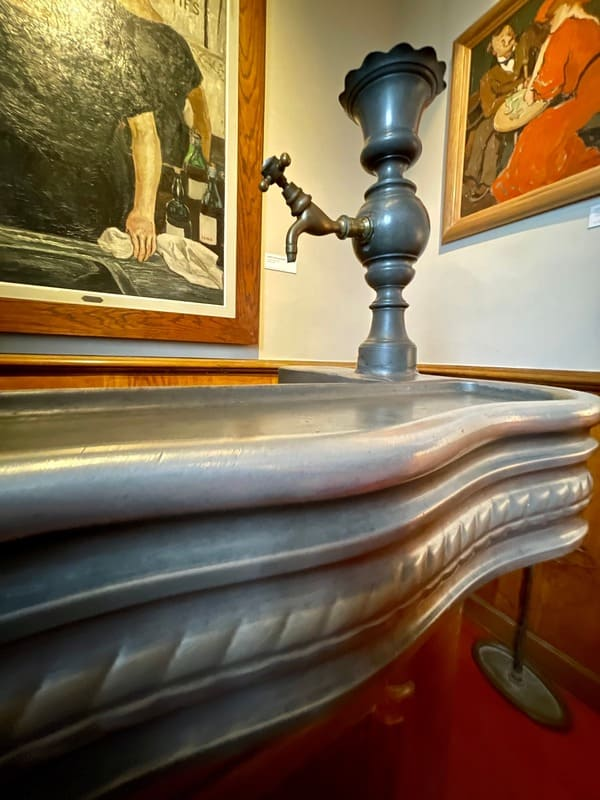
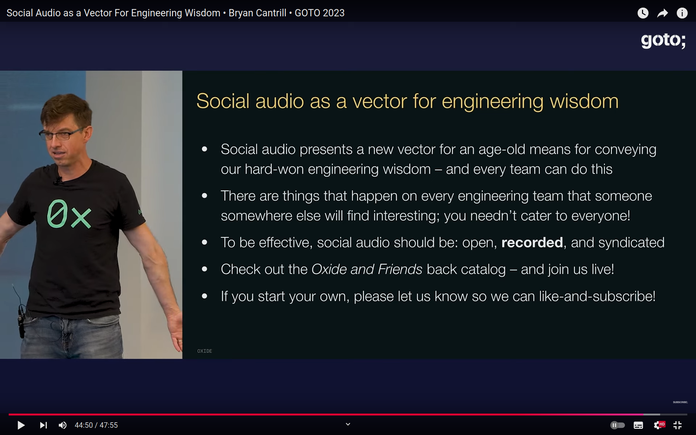

title: About The Underbar
subtitle: A campfire story, with too many details
---

## The Concept

If there's one thing I like more than writing code, it's *talking*
about code. My best memories about code usually involve a late night
discussion with a drink in one hand and *no keyboard* in the other.

In 2024, I seriously started listening to podcasts. "Live conversation
with eventual interventions from the audience" is the format I find to
be the closest to the bar conversations I like so much, and I'd love to
listen to (and chat with) my friends from the open source community,
talking about random mostly technical topics.

So, I figured I should just try it! How hard can it be to setup a
conference call, invite a few interesting people, pick a topic to start
the conversation, hit "record", and stop after roughly one hour?
And make the recording public afterwards, for others to enjoy.

<small>
(If you don't like the undertones of "bar", you can think of this as "campfire stories".)
</small>

## The Intent

My primary goal is to have fun chatting with my friends about
interesting topics on a regular basis.

I also believe that given enough time, the transcripts and notes I
collect will build up an interesting (and valuable) collection of
source material about and around the Perl and Open Source communities
and projects.

I'm actually hoping that someone (maybe me, maybe an actual author, or a
scholar) will use this raw material to build something even more
interesting on top of it. This could be a commercial book, for example,
and I'd be open to collaborate on that.

## The Name

The podcast's name comes from a quick brainstorm with Olaf Alders on
the TPRF Slack, on December 27, 2024. The conversation went like this:

> * **Philippe**  
>   We just need a name for it.
>
>   I had a not-too-bad idea at some point, but didn't write it down.
>
>   Quick brainstorm:
>   * The Camel's Oasis
>   * The Perl Bar
>   * Perl Talk
>   * Dollar Underscore
>   * The Underbar
>   * Topicalizer
>
>   I like _The Underbar_, as a reference to `$_` and to a bar.
>
> * **Olaf**  
>   Yes, that sounds like a winner.

And just like this, in the span of ten minutes, we had a name.

## The Logo

On January 12, 2025, I was chatting about the podcast on IRC with
Thibault Duponchelle. After announcing that Ricardo and Olaf had
agreed to be regular hosts on the podcast, I exposed my idea for the
logo (in French):

>     <BooK> Logo pour the underbar: un $_
>     <BooK> Le _ représente le zinc, et le $ la tireuse à bière.
>            On pose une chope entre les deux, et boum.
>     <BooK> Trois caractères Unicode.
>     <tib> OK bonne idée pour le logo

Translation:

>     <BooK> Logo for the underbar: a $_
>     <BooK> The _ represents the counter, and the $ the beer tap.
>            Put a beer mug in between, and boom.
>     <BooK> Three Unicode characters.
>     <tib> OK good idea for the logo

Here's what a traditional French "zinc" looks like:

   
  <small>(Photo from <https://francewithvero.com/blog/le-zinc-a-french-cafe-icon/>)</small>

I produced the actual design the day after, using [Inkscape](https://inkscape.org/).

The font used for the dollar sign (`$`) and underscore (`_`) characters is
[Courier New Bold](https://en.wikipedia.org/wiki/Courier_(typeface)#Courier_New).
The [beer mug](https://openmoji.org/library/emoji-1F37A/)
([`U+1F37A`](https://emojipedia.org/beer-mug)) comes from
[OpenMoji](https://openmoji.org/) – the open-source emoji and icon project.

## The Inspiration (or, How We Got Here)

I love learning about the _history_ of science (especially mathematics)
and computing. I also love _stories_ (not to mention gossip), especially
when told by those who were there. To quote (and translate) my
grandmother: "History is first and foremost _stories_".

At work, I was inspired by a few colleagues:

* Gurunandan Bhat, who started the _Booking Oral History_ project, which
  he described as "A personal project where I post weekly conversations
  with people whose work and craftsmanship I admire and whose help over
  the years I have had the good fortune to receive. I hope that those
  who are new here get to know about these amazing coworkers and are as
  inspired by their work as I am". He published 5 episodes between April
  and June 2017. (I was interviewed for episode 6, but that was never
  published.)
* Robert Nilsson, who recorded a number of video interviews of
  colleagues in 2018-2019, as part of a project he called _War Stories_.
  Sadly, he left the company before publishing it. I managed to get the
  recordings for my private collection, and I cherish them. (I was also
  interviewed as part of that project, having been in the company for
  twelve years at the time.)

In 2022, I started recording _Dino AMA_ calls, where long-tenured colleagues
about to leave the company would reply to questions from colleagues on a Zoom
call. At the time of writing (June 2025), I did three.

At work, some of my colleagues have a lot of experience (inside or
outside the company), and we sometimes engage in "old men ranting calls"
about random (work or non-work) topics. Although they often contain
nuggets of wisdom and plenty of sarcasm, we haven't recorded them so
far. (They would be too controversial to share anyway...)

This podcast also would not exist if I hadn't listened to:

* [On The Metal](https://onthemetal.transistor.fm/) (recommended by my colleague Bailey Stewart)
* [Digital Citizen](https://www.fastmail.com/digitalcitizen/) (hosted by my friend Ricardo Signes)
* [Advent of Computing](https://adventofcomputing.com/) (recommended by Ricardo)
* [Oxide and Friends](https://oxide-and-friends.transistor.fm/) (the successor of _On The Metal_)

_On the Metal_ and _Digital Citizen_ featured interviews of computing luminaries.

_Advent of Computing_ is dedicated to the history of the field, from its inception
until the rise of the personal computer, and very well researched.

_Oxide and Friends_ feels like being in a bar conversation with other
technical people. I don't always fully understand what they're talking
about, but I definitely like what I hear.

Bryan Cantrill of [Oxide](https://oxide.computer) has strong opinions about
sharing engineering knowledge, which [he presented](https://www.youtube.com/watch?v=W8qiDhlFVCE)
at [GOTO Chicago 2023](https://gotopia.tech/conferences/66/goto-chicago-2023).

   
  (a slide from Bryan Cantrill's talk _Social Audio as a Vector For Engineering Wisdom_)

The key point from the slide above:

> * To be effective, social audio should be: open, **recorded**, and syndicated

So, it's no surprise that towards the end of 2024, I had been thinking
for some time about setting up something like this with people I know. I had
first been thinking about having those conversations with colleagues, but
corporate security and secrecy wouldn't be amenable to that (even if we
limited us to internal communications).

On November 28, 2024, I finally exposed my idea to Olaf Alders, who replied:

> Honestly, it sounds like a great idea and possibly a low friction way to share information.

I first had to finish [the article I had
promised](https://perladvent.org/2024/2024-12-22.html) for the [Perl
Advent Calendar](https://perladvent.org/), but the idea had taken root,
and I had talked with too many people about it already.

So I eventually stopped planning for perfection, got Olaf and Ricardo on
board, invited more people involved with the new Perl logo (the topic of
the [Perl Advent entry published the day after mine](https://perladvent.org/2024/2024-12-23.html)),
talked with Amber Krawczyk from TPRF to setup a Zoom meeting with
recording. And on January 10, 2025, the magic happened.

## The Format

In the beginning, I was keen on the idea of interventions from
the audience, but that requires live streaming which was a bit
complicated to start with.

It only took me a few episodes to figure out that inviting the right mix
of people was the best way to produce a great conversation. Along with
preparation, and sufficient knowlegde and understanding of the topic.

The most important thing for me is not pleasing the audience: it's
OK if you don't understand everything that's being said. I plan on
having transcripts, accompanied with copious notes and links.

My long-term goal for this podcast is that it can serve as a "primary
source" (as Sean Haas from [Advent of Computing](https://adventofcomputing.com/)
calls them) for historians of computing (and the bit I know the best: [Perl](https://www.perl.org/)).

## The License

All the content related to The Underbar (recordings, transcripts, notes,
etc.) is licensed under a
[Creative Commons Attribution-NonCommercial-ShareAlike 4.0 International License](http://creativecommons.org/licenses/by-nc-sa/4.0/).

For alternative licensing options, please contact [Philippe Bruhat](mailto:underbar@cpan.io).

## The Participation Rules

By accepting an invitation to join the podcast and be recorded,
you transfer copyright on the recordings and transcripts of
your contributions, and grant permission to _The Underbar_'s
owners to publish them on this website and the associated
[Git repository](https://github.com/book/the_underbar).

## This is not the `(bar|podcast)` you are looking for

First of all, _The Underbar_ is not the first Perl podcast:

* [Perlcast](https://www.perlcast.net/), by Josh McAdams, ran from 2005 to 2010.

Although I thought I had found an original and inventive name for this
podcast, it turns out I didn't really. The name is already used by
other podcasts:

* [Under The Bar](https://underthebarpodcast.com/) is a Sydney-based
  fitness podcast (last episode published in July 2021).
* [En Underbar Pod med Clara och Erica](https://podcasts.apple.com/us/podcast/en-underbar-pod-med-clara-och-erica/id1148963533)
  is a Swedish ("underbar" means "wonderful" in Swedish) podcast (last
  episode published in June 2021).
* [Under BAR Review](https://linktr.ee/underbarreview) is a fútbol
  podcast, by "a few friends who love the game, cracking open beers
  and talking teams, matches, players, rivalries, and all the drama in
  between". Started in July 2025.
* [Under the Bar](https://open.spotify.com/show/714BfC3He6b41XASNWAtWT)
  is a podcast that "takes you behind the scenes of law, legal tech, and
  life's unexpected twists". Started in September 2025.

And also bars:

* [The UnderBar](https://www.underbar.biz/) is a proud 100% LGBTQ+
  owned bar in Vancouver, Canada.
* [Underbar](https://www.instagram.com/UnderbarCraighallPark/) is a
  basement bar/lounge in Johannesburg, South Africa.
* [Underbar](https://www.underbar.no/) is a whisky bar in Oslo, Norway
  ("underbar" also means "wonderful" in Norwegian).
* [Underbar](https://underbarchicago.com/) is a bar in Chicago, USA.

And restaurants:

* [Underbar](https://www.underbar.com.au/) is a restaurant in Ballarat,
  Victoria, Australia.
* [Underbar](https://restaurangunderbar.se) is a Lebanese restaurant
  in Stockholm, Sweden.
* [Underbar](https://underbarvisby.se/) is a Lebanese restaurant (same
  chain as the above) in Visby, Sweden.

The underbar also a [Parkour technique](https://londonparkour.com/tutorial/basic-underbar/).
